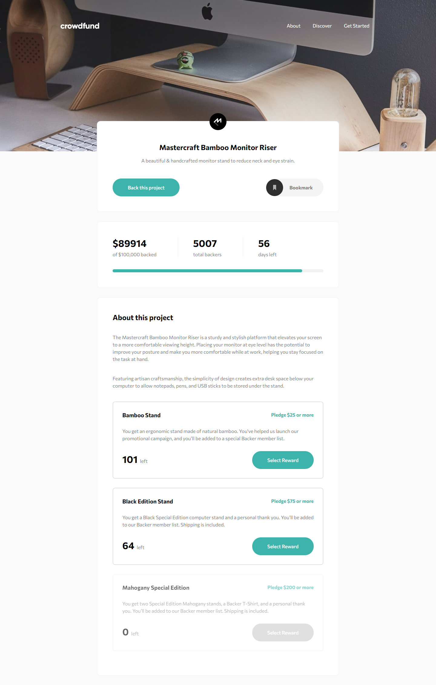
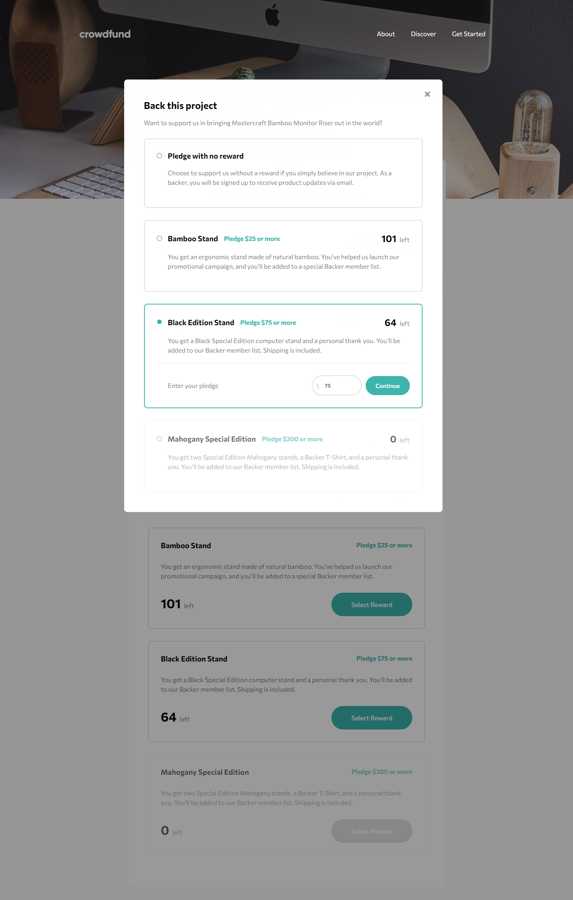
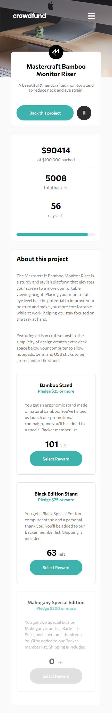
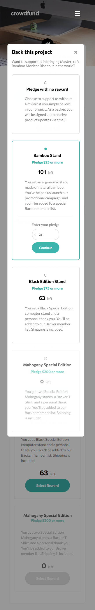

# Frontend Mentor - Crowdfunding product page solution
  

### The challenge

Users should be able to:

- View the optimal layout depending on their device's screen size
- See hover states for interactive elements
- Make a selection of which pledge to make
- See an updated progress bar and total money raised based on their pledge total after confirming a pledge
- See the number of total backers increment by one after confirming a pledge
- Toggle whether or not the product is bookmarked

### Screenshot

Computer view

Computer reward menu

Mobile view

Mobile reward menu

### Built with

- HTML5
- CSS
- Javascript
- Flexbox

### What I learned

Hardest challenge so far.
I've learned a lot of stuff about using functions, stocking DOM informations, displaying modal.

### Features

- Selects an offer to back
- Displays the informations of offers one by one
- Controls if the price entered is correct
- Shows current total backers number
- Shows total amount and working progress bar
- Grey out offers when there's not any left, making it impossible to pledge
